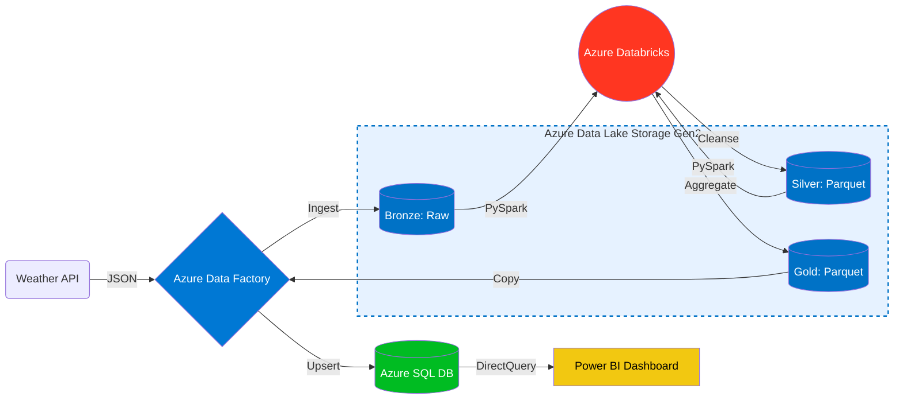

# Azure Weather Data Engineering Pipeline

This project demonstrates an end-to-end Azure Data Engineering pipeline that ingests real-time weather data from a REST API, processes it using Medallion Architecture (Bronze, Silver, Gold), and serves analytics-ready data through Azure SQL Database and Power BI.

---

## Project Overview

The pipeline is designed to simulate a real-world data engineering workflow on Azure. It covers data ingestion, storage, transformation, aggregation, and visualization using industry-standard tools and practices.

---

## Architecture



1. **Ingestion Layer (API -> ADF -> ADLS Gen2)**
   - External source: REST API (`api.weatherapi.com`).
   - Azure Data Factory (`Copy Data` activity) triggers HTTP GET requests.
   - Sink: Azure Data Lake Storage Gen2 (`bronze` container). Data lands in raw, multi-line JSON format preserving the exact source schema.

2. **Storage Layer (ADLS Gen2)**
   - Implements a hierarchical namespace for optimized big data analytics.
   - **Bronze**: Immutable landing zone (`*.json`).
   - **Silver**: Cleansed, flattened, and typed data stored as Snappy-compressed Parquet (`*.parquet`).
   - **Gold**: Business-level aggregates stored as Parquet, ready for serving.

3. **Compute Layer (Azure Databricks)**
   - Securely accesses ADLS via standard OAuth 2.0 Service Principal authentication (`dbutils.fs.mount`).
   - Executes PySpark jobs (`bronze_to_silver`, `silver_to_gold`) using distributed RDDs under the hood.
   - Handles schema enforcement (`cast()`), complex JSON flattening (`col("nested.field")`), and aggregations (`groupBy()`, `agg()`, `max()`, `avg()`).

4. **Serving Layer (Azure SQL Database)**
   - PaaS relational database serving as the Gold data mart.
   - Pipeline uses ADF `Copy Data` activity with PolyBase/Bulk Insert (`upsert` behavior) to continuously sync ADLS Gold Parquet data into the `weather_gold` SQL table.

5. **Visualization (Power BI)**
   - Connects to Azure SQL via DirectQuery for near real-time dashboards or Import mode for high-performance cached reporting.

---

## Core Technologies

- **Azure Data Factory (ADF)**: Orchestration, Linked Services, Pipeline JSON definitions.
- **Azure Data Lake Storage (ADLS Gen2)**: Distributed cloud storage.
- **Azure Databricks**: Apache Spark, PySpark DataFrames, DBFS (Databricks File System).
- **Azure SQL Database**: Relational Data Warehouse, T-SQL DDL/DML.
- **Power BI**: DAX, Dashboarding.
- **Infrastructure as Code (IaC)**: Bash (Azure CLI `az storage`, `az group` commands).

---

## Repository Structure


```text
azure-weather-data-pipeline/
├── adf/
│   ├── linkedServices.json        # ADF connection settings (ADLS, SQL, Databricks, REST API)
│   └── pipeline.json              # ADF pipeline definition (Data movement & Orchestration DAG)
├── architecture/
│   └── azure_weather_architecture_diagram.png # System Architecture Image
├── databricks/
│   ├── bronze_ingestion.py        # Validates and loads raw multi-line API JSON
│   ├── silver_transform.py        # Cleans, flattens nesting, and enforces schema (Parquet)
│   ├── gold_aggregation.py        # City-level aggregations (max temp, avg humidity) (Parquet)
│   └── mount_storage.py           # Mounts ADLS to Databricks DBFS via Service Principals
├── infrastructure/
│   └── setup_azure_resources.sh   # Bash script to provision ADLS Gen2 programmatically
├── powerbi/
│   └── README.md                  # Instructions for Power BI DirectQuery/Import connections
├── sample_data/
│   └── weather_sample.json        # Example raw API response schema
└── sql/
    ├── create_weather_gold_table.sql # SQL DDL for Gold layer serving table (matches Gold Parquet schema)
    └── sample_queries.sql         # Example analytical T-SQL queries
```

---

## Getting Started

1. **Deploy Infrastructure**:
   - Install Azure CLI and `az login`.
   - Run `infrastructure/setup_azure_resources.sh` to create the Resource Group and Data Lake Storage with `bronze`, `silver`, and `gold` containers.

2. **Configure Databricks**:
   - Create an Azure Databricks workspace.
   - Run `databricks/mount_storage.py` (after configuring your Service Principal secrets) to mount the ADLS containers.
   - Import the python files in `databricks/` as notebooks.

3. **Set Up Azure SQL**:
   - Provision an Azure SQL Database.
   - Run the script in `sql/create_weather_gold_table.sql` to create the target table.

4. **Deploy Data Factory**:
   - Create an Azure Data Factory instance.
   - Use the JSON files in `adf/` to create linked services and the main orchestration pipeline. Set your specific connection string secrets.

5. **Visualization**:
   - Refer to `powerbi/README.md` to connect your dashboard to Azure SQL.
